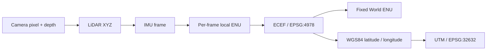

# KITTI Coordinate Mapping

Tools for projecting KITTI LiDAR into camera images, georeferencing scans to WGS84/UTM/ECEF, merging multiple frames in a fixed world frame, and back-projecting camera pixels into world coordinates.

The default examples use `2011_09_26_drive_0048_sync`, frame `6`, and camera `02`. See the generated [results report](Results/REPORT.md) for measured outputs, figures, and numerical checks.

## Features

- Download and extract the required KITTI raw sequence and calibration files.
- Project a synchronized Velodyne scan onto a rectified camera image.
- Convert LiDAR points to local ENU, ECEF, WGS84 latitude/longitude, and UTM.
- Merge several LiDAR frames in one fixed World ENU frame using OXTS poses.
- Convert rectified camera pixels plus depth to LiDAR, World, UTM, and ECEF coordinates.
- Export CSV, JSON, NPZ, PCD, and visualization artifacts.
- Validate transforms with analytic cases, round trips, and independent PROJ topocentric calculations.

## Coordinate pipeline



The coordinate conventions are:

| Frame | Axes / meaning |
|---|---|
| LiDAR | `x` forward, `y` left, `z` up |
| Camera image | `u` right, `v` down |
| Local ENU | East, North, Up at the selected frame's OXTS position |
| World | Fixed ENU with its origin at the reference IMU frame, frame `0` by default |
| ECEF | Earth-centered, Earth-fixed Cartesian XYZ in meters |
| UTM | WGS84 projected Easting/Northing; this sequence uses zone 32N, EPSG:32632 |

## Requirements

- Python 3.9+
- Bash, `unzip`, and either `wget` or `curl` for the downloader

Install all Python dependencies:

```bash
python -m pip install -r requirements-mapping.txt
```

For LiDAR-to-geographic conversion only:

```bash
python -m pip install -r requirements-geographic.txt
```

## Download the KITTI data

The downloader is configured for:

- `2011_09_26_calib.zip`
- `2011_09_26_drive_0048_sync.zip`

On Linux or Git Bash:

```bash
bash ./raw_data_downloader.sh
```

On Windows PowerShell with Git for Windows:

```powershell
& 'C:\Program Files\Git\bin\bash.exe' ./raw_data_downloader.sh
```

Downloads and extracted files are written to the current project directory. Edit the `files` array in [`raw_data_downloader.sh`](raw_data_downloader.sh) to change the selected archives. A ZIP is removed only after successful extraction.

## Usage

### 1. Project LiDAR onto a camera image

```bash
python project_lidar_to_camera.py
```

The default command projects frame `6` onto camera `02`, the left color camera, and writes:

```text
outputs/lidar_on_camera_02_0000000006.png
```

Choose another frame, camera, or sequence:

```bash
python project_lidar_to_camera.py --frame 10 --camera 2
python project_lidar_to_camera.py --sequence PATH_TO_SYNC_SEQUENCE --frame 0
```

The projection is:

```text
[u*s, v*s, s]^T = P_rect_02 R_rect_00 T_velo_to_cam [x, y, z, 1]^T
```

The first two components are divided by positive camera depth `s`. Points behind the camera or outside the image are excluded. Colors encode depth from red (near) to blue (80 m or farther).

### 2. Convert LiDAR to WGS84, UTM, and ECEF

Convert the complete default scan:

```bash
python lidar_to_geographic.py --frame 6
```

Convert one or more manually specified LiDAR points:

```bash
python lidar_to_geographic.py --frame 6 --point 10 0 0
```

The transform chain is:

```text
p_imu  = inverse(T_lidar_from_imu) p_lidar
p_enu  = Rz(yaw) Ry(pitch) Rx(roll) p_imu
p_ecef = origin_ecef + R_ecef_from_enu p_enu
p_ecef -> WGS84 longitude/latitude -> UTM
```

`calib_imu_to_velo.txt` stores IMU → LiDAR, so the program inverts it. KITTI yaw is zero toward east and increases counterclockwise in radians.

Default outputs are written under `outputs/geographic/`:

| File | Contents |
|---|---|
| `*_scan.csv` | Original point index, LiDAR XYZ, intensity, UTM, WGS84, assumed height, local ENU, and ECEF XYZ |
| `*_scan_utm.pcd` | UTM Easting/Northing and assumed ellipsoidal height |
| `*_scan_ecef.pcd` | ECEF XYZ, EPSG:4978 |
| `*_scan.json` | CRS definitions, input paths, OXTS pose/status, timestamps, transforms, assumptions, and numerical checks |

PCD coordinates are stored as ASCII float64. Viewers that internally convert large coordinates to float32 may need a global coordinate shift.

### 3. Merge multiple point-cloud frames

Merge selected frames with a 0.2 m voxel filter:

```bash
python merge_point_clouds.py --frames 0 3 6 9 12 15 18 21 --voxel-size 0.2
```

Merge all available frames without voxel filtering:

```bash
python merge_point_clouds.py --voxel-size 0 --output-dir outputs/merged_full
```

Each scan is transformed with its corresponding OXTS pose and placed in the same fixed World, UTM, and ECEF systems. The program does not apply ICP, pose optimization, per-point deskew, or moving-object removal.

Default outputs under `Results/MultiFrame/` are:

| File | Contents |
|---|---|
| `merged_world.pcd` | Fixed World ENU point cloud |
| `merged_utm.pcd` | UTM point cloud |
| `merged_ecef.pcd` | ECEF point cloud |
| `merged_points.npz` | All coordinate systems plus intensity, `frame_id`, and original `point_index` |
| `merged.json` | World reference, transforms, trajectory, frame metadata, and overlap statistics |

Voxel filtering retains the first original point in each fixed-World voxel. It does not average or fit points, so source identity remains available in the NPZ file.

### 4. Convert camera pixels to World / UTM / ECEF

Generate five reproducible examples from exact LiDAR projections:

```bash
python camera_pixel_to_world.py --frame 6 --camera 2
```

Convert a pixel using an explicitly supplied optical-axis depth:

```bash
python camera_pixel_to_world.py \
  --pixel 620 200 \
  --depth-m 20 \
  --output-dir outputs/pixel_custom
```

The value `20` above demonstrates the command syntax; it is not a measured depth for that pixel.

Alternatively, use the closest projected LiDAR sample within two pixels:

```bash
python camera_pixel_to_world.py \
  --pixel 620 200 \
  --max-pixel-distance 2 \
  --output-dir outputs/pixel_lidar
```

A pixel alone defines a ray, so 3D reconstruction requires depth. With

```text
P_total = P_rect R_rect_00 T_velo_to_cam = [M | b]
```

the inverse projection is:

```text
p_lidar = inverse(M) (depth [u, v, 1]^T - b)
```

Depth is the optical-axis projection scale `s`, not Euclidean range. The complete translation `b`, including the stereo baseline, is retained.

When depth comes from LiDAR, a sparse z-buffer keeps the nearest sample per image pixel. Transferring depth to a nearby pixel assumes both pixels represent the same surface and does not fully resolve camera/LiDAR occlusion. The CSV and JSON outputs record the matched LiDAR index and pixel distance.

### 5. Generate all result artifacts

```bash
python generate_mapping_results.py
```

This generates ECEF, multi-frame, and pixel-to-world artifacts plus a Vietnamese report with figures:

- [`Results/REPORT.md`](Results/REPORT.md)
- `Results/ECEF/`
- `Results/MultiFrame/`
- `Results/CameraToWorld/`

Select a subset of frames or another output directory:

```bash
python generate_mapping_results.py \
  --frames 0 6 12 18 21 \
  --output-dir outputs/report_subset
```

## Accuracy and limitations

- One OXTS pose is applied to an entire LiDAR scan. There is no pose interpolation or per-point motion compensation.
- Moving objects are not detected or removed and may appear multiple times in a merged cloud.
- OXTS text files label the value only as `altitude (m)` and do not identify its vertical datum.
- The computation treats `OXTS altitude + --height-offset-m` as WGS84 ellipsoidal height. No geoid model is applied automatically.
- UTM coordinates account for projection scale and grid convergence. Adding local ENU offsets directly to an initial UTM coordinate would omit these effects.
- Numerical round-trip errors validate implementation consistency; they are not surveyed positioning accuracy.
- Nearest-neighbor distances between scans also include sampling density, occlusion, scene motion, and non-overlapping areas.

See [Results/REPORT.md](Results/REPORT.md) for the measured numerical checks and their interpretation.

## Tests

```bash
python -m unittest test_lidar_to_geographic test_mapping_pipeline -v
```

The tests cover:

- analytic ECEF reference coordinates;
- independent PROJ topocentric checks;
- WGS84/UTM/ECEF round trips;
- complete camera projection inversion, including translation and stereo baseline;
- positive-depth validation and sparse z-buffer selection;
- a static scene observed from translated and rotated poses;
- per-point provenance through voxel filtering;
- float64 PCD export.

## Project layout

| Path | Purpose |
|---|---|
| `raw_data_downloader.sh` | Download the selected KITTI raw data |
| `project_lidar_to_camera.py` | LiDAR → rectified camera projection |
| `lidar_to_geographic.py` | LiDAR → ENU / ECEF / WGS84 / UTM |
| `merge_point_clouds.py` | Multi-frame point-cloud merge |
| `camera_pixel_to_world.py` | Pixel + depth → LiDAR / World / UTM / ECEF |
| `generate_mapping_results.py` | Reproduce the complete result set and report |
| `check_lidar_alignment.py` | Inspect projection consistency and timestamps |
| `bin_to_pcd.py` | Convert one KITTI Velodyne BIN file to PCD |
| `test_lidar_to_geographic.py` | Geographic-transform tests |
| `test_mapping_pipeline.py` | Camera, ECEF, merge, and export tests |

## References

- [KITTI Vision Benchmark Suite — Raw Data](https://www.cvlibs.net/datasets/kitti/raw_data.php)
- [Geiger et al., *Vision meets Robotics: The KITTI Dataset*](https://www.cvlibs.net/publications/Geiger2013IJRR.pdf)
- [pykitti coordinate utilities](https://github.com/utiasSTARS/pykitti/blob/master/pykitti/utils.py)
- [PROJ geocentric to topocentric conversion](https://proj.org/en/stable/operations/conversions/topocentric.html)
- [OxTS NCOM documentation](https://www.oxts.com/software/navsuite/documentation/manuals/NCOM_man.pdf)

## License

See [LICENSE](LICENSE).
